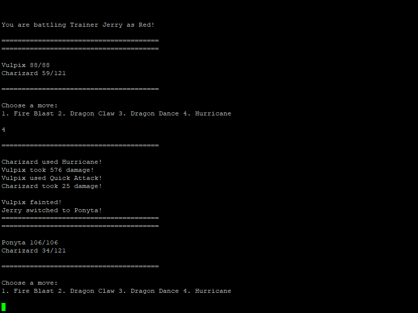
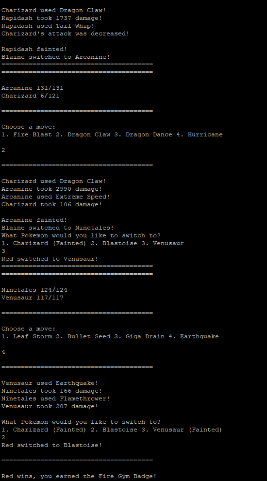

# Fun Game :)

Authors: [Caleb DeSouza](https://github.com/c9leb), [Riya Patel](https://github.com/Patelriyaaa), [Ezekiel Pogue](https://github.com/ezpogue), [Matthew Ramer](https://github.com/MatthewRamer)

## Project Description
For our project we will be making a Pokemon inspired text based RPG. In the Pokemon series of games, the player controls a Pokemon trainer. The gameplay is focused around collecting monsters, training them to be stronger, and battling them against other trainers. It is effectively legal dogfighting marketed towards children.
### Language and Tools
We will be writing this game in [C++](https://www.cplusplus.com/), and will be utilizing tools such as [GitHub](https://github.com/), [GoogleTest](https://github.com/google/googletest), [Valgrind](https://www.valgrind.org/), etc. 
### Input and Output
For input and output we will be using the terminal. The game will output the current situation, along with options on how to proceed. The user will then input what they want to do, and the game will respond accordingly. 
### Features
Features of the game will include core Pokemon battle features, such as choosing moves based on their effectiveness, swapping Pokemon, and [whiting out because of Whitney's Miltank](https://rage-quit.fandom.com/wiki/Whitney%27s_Miltank_(Pok%C3%A9mon)).

## Class Diagram
Our class diagrams can be viewed [here.](https://lucid.app/lucidchart/bead12b5-0e52-4913-a2b0-adf8b4624c81/edit?viewport_loc=13%2C-36%2C2219%2C989%2C0_0&invitationId=inv_2795bc8a-8a70-4143-a02d-184a171e0b08)
 
## Design Patterns
### Composite Pattern
We utilize the composite pattern in our Move class. We have leaf classes for different types of moves, such as Attacks, which do damage to the enemy Pokemon, Buffs, which raise the stats of the player's Pokemon, and debuffs, which lower the stats of the enemy Pokemon. By creating a composite class, we can have moves that can, for example, do damage and buff, or debuff and buff, or buff multiple stats. This allows creative moves to be implemented in our game.

### Facade Pattern
We utilize the [facade pattern](https://en.wikipedia.org/wiki/Facade_pattern) in our Battle class. The game mechanics are fairly complicated, and require calling many methods of different objects to perform things like single moves. The Battle class acts as the facade, and a single method in the Battle class can call all methods needed for an entire turn of a fight.

 > ## Final deliverable
 > All group members will give a demo to the TA during lab time. The TA will check the demo and the project GitHub repository and ask a few questions to all the team members. 
 > Before the demo, you should do the following:
 > * Complete the sections below (i.e. Screenshots, Installation/Usage, Testing)
 > * Plan one more sprint (that you will not necessarily complete before the end of the quarter). Your In-progress and In-testing columns should be empty (you are not doing more work currently) but your TODO column should have a full sprint plan in it as you have done before. This should include any known bugs (there should be some) or new features you would like to add. These should appear as issues/cards on your Project board.
 > * Make sure your README file and Project board are up-to-date reflecting the current status of your project (e.g. any changes that you have made during the project such as changes to your class diagram). Previous versions should still be visible through your commit history. 
 
 ## Screenshots

 ## Installation/Usage
 To run the game, clone the repository and compile with CMake. Then the game can be run using the generated executable.
 
 To play the game, you can choose options 1 - 4 to use a move, or you can switch Pokemon by inputting 5-7. If your Pokemon faints you can use 1-3 to choose a replacement. Please don't try a number that's outside of those ranges because it will probably break it. :(
 ## Testing
 We have around 50 unit/integration tests for our classes testing almost every function. We have also manually gone through the program and tested it to make sure it is winnable and that there are no major bugs that can't be directly tested for.
